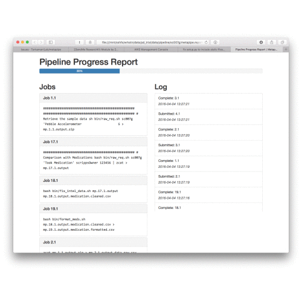

# Metapipe

*A pipeline generator and runtime system*

[](https://travis-ci.org/TorkamaniLab/metapipe)
[](https://coveralls.io/github/TorkamaniLab/metapipe?branch=master)
[](https://img.shields.io/badge/Python-2.7-blue.svg)
[](https://img.shields.io/badge/Python-3.4-blue.svg)
[](https://img.shields.io/badge/Python-3.5-blue.svg)
[](https://github.com/TorkamaniLab/metapipe/blob/master/LICENSE)

Metapipe is a simple command line tool for building and running complex analysis pipelines. If you use a PBS/Torque queue for cluster computing, or if you have complex batch processing that you want simplified, metapipe is the tool for you.



Metapipe's goal is to improve **readability**, and **maintainability** when building complex pipelines.

In addition to helping you generate and maintain complex pipelines, **metapipe also helps you debug them**! How? Well metapipe watches your jobs execute and keeps tabs on them. This means, unlike conventional batch queue systems like PBS/Torque alone, metapipe can give you accurate error information, and even resubmit failing jobs! Metapipe enhances the power of any PBS/Torque queue!

- What if I [don't use PBS/Torque](#other-queue-systems), or [a queue system at all?](#no-queue-no-problem)


## How do I get it?

It's super simple!

`pip install metapipe`

To make it easy, metapipe runs on Python 2.7, 3.4, and 3.5!


## What does it do?

In the bad old days (before metapipe), if you wanted to make an analysis pipeline, you needed to know how to code. **Not anymore!** Metapipe makes it easy to build and run your analysis pipelines! **No more code, just commands!** This makes your pipelines easy to understand and change!


## Documentation & Help

[Check out the full documentation at ReadTheDocs &#8594;](http://metapipe.readthedocs.org/en/latest/index.html)

If you need help with Metapipe, or you'd like to chat about new features, get in touch by filing an issue, or at `#metapipe` on freenode!


### Here's a sample!

Let's say you have a few command-line tools that you want to string together into a pipeline. You used to have to know Python, Perl, Bash, or some other scripting language; now you can use Metapipe!

```bash
[COMMANDS]
# Let's get the first and third columns from each of
# our files, and put the output in seperate files.
cut -f 1,3 {1||2||3} > {o}

# Once that's done, we'll need to take the output and 
# run each through our custom processing script individually.
# Here we can give a custom extension to the default output file.
python3 my_script.py --output {o.processed.csv} -i {1.*||}

# Finally, we want to collect each sample and analyze 
# them all together. We also need to use a custom version 
# of Python for this.
custom_python anaylysis.py -o {o.results.txt} {2.*}

[FILES]
1. controls.1.csv
2. controls.2.csv
3. controls.3.csv

[PATHS]
custom_python ~/path/to/my/custom/python/version
```

Excluding the comments, this entire analysis pipeline is 13 lines long, and extremely readable! What's even better? If you want to change any steps, its super easy! That's the power of Metapipe!


## No Queue? No Problem!

Lots of people don't use a PBS/Torque queue system, or a queue system at all, and metapipe can help them as well! Metapipe runs locally and will give you all the same benefits of a batch queue system! It runs jobs in parallel, and provide detailed feedback when jobs go wrong, and automatic job re-running if they fail.

To run metapipe locally, see the app's help menu!

`metapipe --help`


## Other Queue Systems

Metapipe is a very modular tool, and is designed to support any execution backend. Right now we only support PBS, but if you know just a little bit of Python, you can add support for any queue easily! *More information coming soon!*
